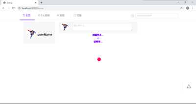
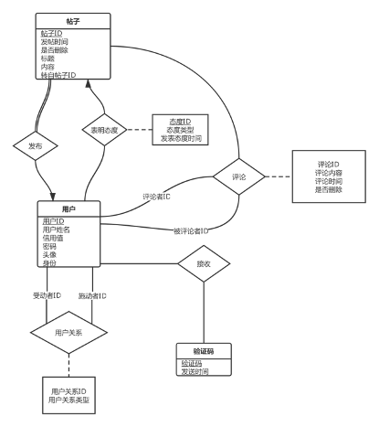

# welog

> 1753731 陈    东	1652977 王星洲	1751059 陈明东	1752058 姜其升	1753948 张    尧

[TOC]

## 1.简介

### 1.1 项目简介

题目：Welog——标记你的社交生活

开发工具：

- 后端：IntelliJ IDEA
- 前端：Visual Studio Code
- 数据库：Oracle 11g/Timesten 11.2.2
- 数据库管理工具：Data Grip

数据规模：

- 用户名（条目数量：167209）
- 点赞（条目数量：10099952）
- 关注（条目数量：10094865）
- 帖子（条目数量：11243601）
- 评论（条目数量：581262）

数据库实验环境：

- 操作系统：Oracle linux 5

- 内存：16G

开发语言：

- 前端：html css javascript

- 后端：Java

- 数据库：PL/SQL

框架：

- 前端：Vue(iView,v-charts,axios)

- 后端：Spring Boot

概述：

该系统是基于Web设计的，旨在为用户提供一个互相交流、获取信息、标记生活的社交平台。根据论坛应有的管理帖子、用户间信息管理、用户间互动等基本功能需求，我们设计了用户信息子系统、帖子信息子系统、评论信息子系统、用户关系信息子系统数据管理等四个子系统模块，并分别对其进行功能需求分析。此外，由于平台对用户交互的要求，我们还对系统健壮性与稳定性等非功能需求进行分析，以此设计一个功能相对完整、用户界面与使用感友好的社交平台系统。

### 1.2 主要功能

#### 用户注册

用户通过邮箱发起注册请求后，系统检查该用户账号是否已经在数据库中存在，如果已经存在，则注册失败，用户用已注册的账号进行登录。如果不存在，系统向该用户的邮箱发送注册验证信息，用户通过验证码验证后账号注册成功。

数据库相关功能：对user表进行查操作和增操作。

数据库所需数据：用户注册账号的学号，账号密码，账号头像。

#### 用户登录

用户通过学号和密码发起登录请求，系统检查用户的账号及其密码是否与数据库中信息匹配，如果匹配，则登陆成功，否则登录失败，并给出失败相关信息提示。

数据库相关功能：对user表进行查操作。

数据库所需数据：用户学号，账号密码。

#### 查看用户主页

显示用户帖子、关注、粉丝。

#### 用户发帖子

用户发布帖子，该帖子会在广场中显示。

数据库相关功能：对userPost表进行增操作。

数据库所需数据：帖子相关信息。

#### 用户删除帖子

用户发起删帖请求，经系统确认后删除该贴。

数据库相关功能：对userPost表进行查操作和删操作。

数据库所需数据：帖子相关信息。

#### 用户搜索帖子

用户在广场搜索栏输入关键字，搜索内容含有该关键字的帖子，然后展示该帖子。或者搜索用户。按时间顺序展示。

数据库相关功能：对user、userPost表进行查操作。

数据库所需数据：帖子相关信息，关键字。

#### 用户评论帖子

用户可以在他人帖子下进行评论。

数据库相关功能：系统对postComment表进行增操作。

数据库所需数据：帖子相关信息，评论相关信息。

#### 用户回复他人评论

用户可以在自己帖子或者他人帖子下回复他人评论。

数据库相关功能：系统对postCommend表进行增操作。

数据库所需数据：帖子相关信息，评论相关信息。

#### 关注操作

用户可以关注其他用户。

数据库相关功能：系统对user_relation表进行增操作。

数据库所需数据：用户信息。

#### 取消关注

用户可以取消关注其他用户。

数据库相关功能：系统对user_relation表进行删操作。

数据库所需数据：用户信息。

### 1.3 项目实验设计

#### 查询功能

对于每种数据库进行上述功能点检索测试，记录每种数据库当数据在以上数量级变化且仅使用SQL查询语句条件下的查询时间，生成性能对比图表。

#### 插入功能

对于每种数据库进行上述功能点插入测试，记录每种数据库当数据在以上数量级变化且仅使用SQL插入语句条件下的插入时间，生成性能对比图表。

#### 使用物化视图

Oracle的物化视图提供了强大的功能，可以用于预先计算并保存表连接、聚集等耗时较多的操作的结果。这个实验我们将在相同数据量级，同种数据库的条件下，对是否使用物化视图的检索功能记录查询时间，生成性能对比图表，观察物化视图对于性能是否有提升，提升有多大。

同时，因为物化视图具有不同的刷新方式，而这些方式又会影响物化视图的性能，我们打算把物化视图以不同的刷新方式，执行不同量级的DML语句进行对比，详细探究物化视图对性能的影响。

#### SQL查询语句优化

对于相同的数据库，有不同的查询方法可以获取想要的数据，对于不同的查询语句数据库也会采用不同的扫描策略。因此我们将通过不断修改SQL语句，对比各个形式下的查询执行时间，形成对比图表。

**实验一：调整WHERE子句中的连接顺序**

ORACLE采用自下而上的顺序解析WHERE子句，根据这个原理，表之间的连接必须写在其他WHERE条件之前，那些可以过滤掉最大数量记录的条件必须写在WHERE子句的末尾。

**实验二： SELECT子句中不使用‘\*’**

ORACLE在解析的过程中，会将‘*’依次转换成所有的列名，这个工作是通过查询数据字典完成的，这意味着将耗费更多的时间。

**实验三：用EXISTS替换DISTINCT**

当提交一个包含一对多表信息（对用户粉丝）的查询时，避免在SELECT子句中使用DISTINCT.一般可以考虑用EXIST替换，EXISTS 使查询更为迅速，因为RDBMS核心模块将在子查询的条件一旦满足后，立刻返回结果

**实验四：使用Where替代Having**

where是用于过滤行的，而having是用来过滤组的，因为行被分组后，having 才能过滤组，所以使用where的过滤速度更快。

#### 索引

**确定值的查找：散列索引、B-树索引、无索引对比（Oracle）**

1、查看某用户关注和粉丝时，在user_relation表中根据actor_id查找有关行。

2、查看某帖子评论时，在post_comment表中根据原帖id来查找行。

我们将对比上面2个操作对于性能的改变。

**有序的查找：T-树索引、B-树索引、单纯排序无索引对比（Oracle/Timesten）**

根据点赞数排序，显示热门的帖子。

**多个索引（Oracle）**

在用户主页上显示用户自己发的帖子时，在post表里根据发帖人id，并且删除标志为=0，建立多个索引（散列复合、B树复合、B树+位图、散列+位图）。

**维护索引**

在用户关系表里大量DML操作（大量关注某些人，大量取消关注某些人），比较不维护索引、重建索引、合并索引所造成的代价、业务操作时间和性能提升程度。找到三者的差异。

根据对表使用方式的不同（比如是否常做删除），维护索引可能并不会带来大的性能提升，所以设计这个实验来权衡代价-性能提升。

#### 使用SQL语句预编译

对比使用预编译插入和不使用预编译的执行时间，得出相应的结论。

#### 数据库连接模式

通过比较不同并发数下，两种数据库连接模式的响应速度，得出更适合此项目的数据库连接方式。

#### 数据类型

**账号存储类型的影响**

对于本项目而言，本项目的全部表都涉及到了ID这个字段，ID的存储方式便十分重要，对于该字段有两种存储方式，即CHAR和NUMBER。我们将针对这一问题，进行如下实验，找出适合ID的存储类型。

**贴子内容**

同时帖子内容涉及到大量的文本字符串的存储，在TimesTen中主要有CHAR，VARCHAR2这两种类型，而存储又会涉及到inline和out-of-line两种方式，因此会对查询时间、占用存储空间等性能造成影响。我们将针对这一问题，进行如下实验，找出不同存储方式的差异和找到最适合的存储方式。

#### 改变block size

我们将在不同的数据库下，在建表时使用不同的表block size大小，记录检索相同内容、相同数量的帖子所耗费的时间长短，以此找到最适合本项目的block size的大小。

#### 系统全局区SGA调整

在配置新的数据库实例时，很难知道共享池缓存的正确大小。首先估算缓存大小，然后将我们所有的业务功能全部运行一遍，然后检查相关统计信息Library Cache Statistics以查看缓存配置不足还是配置过度

### 1.4 实验目的

Oracle数据库也称为Oracle RDBMS，是目前世界上流行的关系数据库管理系统，系统可移植性好，使用方便，功能强劲，可用于各类大中小微机环境，是一种高效率、可靠性好、适应高吞吐量的数据库解决方案。

数据库实现了对海量数据的存储和管理，现代数据库还实现了对数据的查询及收集功能，在微博社交系统中有重要作用。随着大数据时代的到来，数据管理和操作的重要性也更为人们所重视。面对日益增长的数据量以及用户对于及时得到系统中最新的微博社交的要求，用户对于系统响应速度的要求也随之提升。因而我们将采用内存数据库的方式加速系统的响应速度。对于数据库选择方案主要有：Oracle、Oracle in memory、Oracle Timesten、 Timesten cache for Oracle。对于以上四种不同的选择方案，我们将针对微博社交系统大量使用的查询和插入功能比较，以此得到四种数据库选择方案在这两种性能随着数据量的增加而产生的差异，得到最适合该项目的数据库。

虽然Oracle数据库在多个角度都表现出优越的性能，但始终无法在初始设计时就预测到日后的所有问题。“没有无BUG的程序”，在运行过程中，随着用户需求的增多和数量的增加，势必会出现新的性能瓶颈。因此，在数据库运行过程中，要不断地发现限制数据库性能的因素，进行性能优化。

数据库是微博社交系统的核心。对数据库性能进行调整和优化，对提高微博社交系统整体数据处理速率有着很大的意义。Oracle公司的各类数据库是一种灵活性强、性能优越、效果显著的数据库，基于Oracle数据库和Timesten数据库对微博社交系统进行性能优化，可以对当前微博社交系统整体数据处理速度、各板块信息交互效率进行有效的提升。本文将对数据库性能优化的必要性进行简单剖析，随后从数据库配置层、数据库设计层、SQL语句运用层以及日常维护四个方面提出优化方案，力图提高现有微博社交系统数据处理性能，减少用户使用的等待时间，提升响应速度和产品质量。

优化的整体目标为以下几点：一、压缩数据库响应时间。数据库响应时间指基于用户和相关信息系统而发出，通过SQL获得结果集的耗费时间，主要通过ms的方式进行描述。数据库响应时间是数据库优化的核心目标，也是提升数据库性能优化的主要方式，通过减少响应时间可以增强用户体验。二、提升吞吐量，增强命中率。命中率指访问特定数据库资源的成功率，这种资源主要是缓冲区域的命中率，解析命中率等因素。因此，优化数据库处理能力的过程中，命中率是较为关键的内容。三、内存应用优化处理。Oracle数据库性能优化中，内存配置的合理性、SGA区域分配大小都是较为重要的性能参数。此外，减少系统频繁置换操作处理，提升磁盘读写过程中I/O系统的响应时间，综合内存系统数据库结构的发展趋势，将内存作为关键内容。四、提升内存利用率，增强CPU资源效率通过加强对CPU的控制，保障系统资源占用率的合理性，提升Oracle数据库的整体性能，快速响应用户的各种请求。通过优化数据资源分布，增强数据的命中率，减少I/O设备中频繁出现数据信息交换。

性能提升实验是为了解决大量数据（千万级）时，数据库的检索插入等功能所花费的时间过长，影响了用户的体验的问题。我们将通过不同的方面设计实验，不断改进我们的数据库设计，并记录实验数据，找出可行的解决方案，使系统在面对大量数据处理时仍表现出肯定的可行性。

我们将使用不同的优化方案，分别验证它们对于性能的影响，并分析优化的可行方案，最终目的是找出一个真正可以解决面对大量数据时数据库性能问题的解决方案。

## 2项目特色及结论

### 2.1 项目特色

该系统是基于Web设计的，旨在为用户提供一个互相交流、获取信息、标记生活的社交平台。根据论坛应有的管理帖子、用户间信息管理、用户间互动等基本功能需求，我们设计了用户信息子系统、帖子信息子系统、评论信息子系统、用户关系信息子系统数据管理等四个子系统模块，并分别对其进行功能需求分析。此外，由于平台对用户交互的要求，我们还对系统健壮性与稳定性等非功能需求进行分析，以此设计一个功能相对完整、用户界面与使用感友好的社交平台系统。

在系统的实现上，我们在前后端分离的基础上，合理拆分组件，使用一种API，充分利用PL/SQL编程技术，模拟现实生活中的真实海量并发操作，在使用海量数据、面对大量并发请求、数据库负载较重的模拟情况下，进行性能优化，并对优化前后的数据库性能进行对比试验，给出试验对比报告及性能优化报告。其中在数据库的选择上，我们将比较Oracle、Oracle in memory、Oracle Timesten、 Timesten cache for Oracle这四种数据库的性能优略，选择合适的数据库。

### 2.2 实验结论

#### 插入功能

**实验结果记录表：**

| **数据库**                             | **千级** | **万级** | **十万级** | **百万级** | **千万级** |
| -------------------------------------- | -------- | -------- | ---------- | ---------- | ---------- |
| **Oracle****（使用****csv****导入）**  | 0.025s   | 0.313s   | 3.593s     | 48s377ms   | 8min54s    |
| **Oracle****（逐条****insert****）**   | 0.414s   | 3.850s   | 33.543s    | 5min41s    | 55min44s   |
| **TimesTen****（逐条****insert****）** | 0.420s   | 3.835s   | 32.320s    | 5min41s    | 55min46s   |
| **TimesTen****（优化****insert****）** | 0.381s   | 3.431s   | 26.947s    | 4min32s    | 46min57s   |

**实验结论：**

数据库的性能对于简单的数据插入影响并不大，数据插入的主要性能关键在于磁盘IO效率。由于TimesTen本身兼容性不如Oracle好等原因，并不能支持csv数据批量导入，只能通过insert的方式插入数据，因此在大批量插入上oracle有优势，但在逐条插入的实际应用场景下两者性能是相近的。同时，优化插入虽然一定程度上优化了数据写入，但是并不能体现出明显优势，在性能上依然比不上数据源批量导入。

#### 查询功能

**实验结果记录表**

| **数据库**   | **千级** | **万级** | **十万级** | **百万级** | **千万级** |
| ------------ | -------- | -------- | ---------- | ---------- | ---------- |
| **Oracle**   | <1ms     | <1ms     | 0.017s     | 0.039s     | 5 s 680 ms |
| **TimesTen** | <1ms     | <1ms     | 0.005s     | 0.028s     | 2 s 213 ms |

**实验结论：**

在查询方面timesten由于内存读取速度更快等原因会更有优势，但是由于timesten的查询优化的服务并不如oracle做的完善（例如后面即将讲到的缓存池，预编译等机制），oracle的缓存机制可以使得其在面对批量相同的服务时（重复的多次查询等）可能会有更好的性能表现。

#### 使用物化视图

**实验结果记录表：（修改后看查询事件）**

| **Timesten****修改次数** | **使用物化视图****Force refresh** | **使用物化视图****Complete refresh** | **使用物化视图****Fast refresh** |      |
| ------------------------ | --------------------------------- | ------------------------------------ | -------------------------------- | ---- |
| **10**                   | 0.120s                            | 0.105s                               | 0.034s                           |      |
| **100**                  | 0.131s                            | 0.098s                               | 0.044s                           |      |
| **1000**                 | 0.103s                            | 0.091s                               | 0.053s                           |      |

**实验结论与分析：**

实验的结论符合我们的预期，由于刷新方式的不同导致刷新时间呈现出不同的变化趋势，我们分析得到的数据，可以看到使用强制刷新和完全刷新的时间基本不随DML操作数据量的改变而改变，基本保持在一个确定的时间范围内；而快速刷新的时间则是会随操作数据量的增大而增大。这主要是他们不同的刷新方式的执行原理造成的。

完全刷新：先把物化视图的数据全部删除，然后把基表的数据插入到物化视图中。当数据达到百万级别时，若原表更新了一条数据，完全刷新就得插入全部数据。这也就使得影响完全刷新执行速度的主要影响因素是基表的数据量，而并非DML操作的数据量。

快速刷新：保留物化视图的数据，然后基表的所有数据的变更记录到物化视图日志中。这就需要我们开启物化视图日志。由于是更具改变的记录的数量确定哪些数据需要刷新，因此该种刷新方式会受到的DML操作数量的影响。

#### SQL查询语句优化

###### 实验一：调整WHERE子句中的连接顺序

**实验结果记录表：**

| **过滤能力查询时间**  | 条件A在后 | **条件B在后** |
| --------------------- | --------- | ------------- |
| **条件A的过滤能力强** | 7 ms      | 8 ms          |
| **条件B的过滤能力强** | 375  ms   | 362  ms       |

**实验结论：**

实验结果表明，调整过滤能力强的句子先后顺序，仅可以起到10%的优化效果，与我们的预期不一致。以条件B的过滤能力强为例，我们对比了条件A在后和条件B在后时oracle的执行计划后，对比发现

| 条件A在后：                                   | 条件B在后：                                   |
| --------------------------------------------- | --------------------------------------------- |
| Statistics                                    | Statistics                                    |
| 10 recursive calls                            | 10 recursive calls                            |
| 0 db block gets                               | 0 db block gets                               |
| 239762 consistent gets                        | 239762 consistent gets                        |
| 23309 physical reads                          | 23361 physical reads                          |
| 0 redo size                                   | 0 redo size                                   |
| 3212250 bytes sent via SQL*Net  to client     | 3212250 bytes sent via SQL*Net  to client     |
| 64335 bytes received  via SQL*Net from client | 64335  bytes received via SQL*Net from client |
| 5803 SQL*Net roundtrips to/from client        | 5803 SQL*Net roundtrips to/from client        |
| 0 sorts (memory)                              | 0 sorts (memory)                              |
| 0 sorts (disk)                                | 0 sorts (disk)                                |
| 87018 rows processed                          | 87018 rows processed                          |

执行计划近乎完全一致。查阅资料后了解到，对于where子句中的多个条件连接，oracle的优化器可以像调整表连接顺序一样自动进行优化，使得连接顺序自动调整为最优后执行，因此时间差仅仅来自于oracle优化器所使用的优化时间。

###### 实验二： SELECT子句中不使用‘*’

**实验结果记录表：**

| **数据库** | **SQL****语句改进前** | **SQL****语句改进后** |
| ---------- | --------------------- | --------------------- |
| **Oracle** | 24.3ms                | 24.2ms                |

**实验结论：**

实验结果表明不使用*并没有明显优势。猜想原因在于我们通常使用的数据库表列数量通常不会太多，查询一次数据字典的耗时不会太长。

我们查看执行计划的关键部分发现

| 使用*：                                   | 不使用*：                                 |
| ----------------------------------------- | ----------------------------------------- |
| Statistics                                | Statistics                                |
| 8 recursive calls                         | 7 recursive calls                         |
| 0 db block gets                           | 0 db block gets                           |
| 41586 consistent gets                     | 41763 consistent gets                     |
| 29477 physical reads                      | 29477 physical reads                      |
| 0 redo size                               | 0 redo size                               |
| 2121514 bytes sent via SQL*Net  to client | 2121514 bytes sent via SQL*Net  to client |
| 0 sorts (memory)                          | 0 sorts (memory)                          |
| 0 sorts (disk)                            | 0 sorts (disk)                            |
| 10961 rows processed                      | 10961 rows processed                      |

在磁盘读写以及扫描块数量上面，仅存在细微差别，最主要的差别来源于数据字典的一次调用，增加了recursive calls的次数，这也是时间差的主要来源。

###### 实验三：用EXISTS替换DISTINCT

**实验结果记录表：**

| **数据库** | **SQL语句改进前** | **SQL语句改进后** |
| ---------- | ----------------- | ----------------- |
| **Oracle** | 1s923ms           | 5ms               |

**实验结论：**

首先说明一下exists的工作原理，exists语句用来判断()内的表达式是否存在返回值，如果存在就返回true，如果不存在就返回false，所以在上面语句中我们使用select null，因为我们不关注返回值。另外exists的优点是，它只要括号中的表达式有一个值存在，就立刻返回true，而不用遍历表中所有的数据。所以在USER_ID同样多的情况下，用distinct需要每次都遍历USER表进行比对，而使用exists只需要比对USER表的一部分，在USER表数据十分庞大时，这种性能差别就能更好的体现出来。

###### 实验四：使用Where替代Having

**实验结果记录表：**

| **数据库** | **SQL**语句改进前 | **SQL语句改进后** |
| ---------- | ----------------- | ----------------- |
| **Oracle** | 1s378ms           | 271ms             |

**实验结论：**

where是用于过滤行的，而having是用来过滤组的，因为行被分组后，having 才能过滤组，所以使用where的过滤速度更快。在USER表数据十分庞大时，这种性能差别就能更好的体现出来。

#### 索引

###### 确定值的查找：散列索引、B-树索引、无索引对比（Oracle）

**实验结果记录表：**

|                | **散列索引** | **B树索引** | **无索引** |
| -------------- | ------------ | ----------- | ---------- |
| **时间（ms）** | 8            | 9           | 285        |

**实验结果记录表：**

|                | **散列索引** | **B树索引** | **无索引** |
| -------------- | ------------ | ----------- | ---------- |
| **时间（ms）** | 2696         | 2603        | 2742       |

**实验结论：**

当我们的字段是一个有明确顺序，并且在查询时进行的不是模糊查询时，索引确实能大大减少查询所需要的时间，然而，散列索引和B树索引之间由于数据量级只有千万级，并不能够比较出明显的差距，具体差距需要更大量级的数据进行检验。

然而当字段被检索时是查找它其中的某一个子字符串时，索引的优势就完全无法发挥了，反倒会增加数据库的负担，得不偿失。

###### 有序的查找：T-树索引、B-树索引、单纯排序无索引对比（Oracle/Timesten）

**实验结果记录表：**

|          | **T树正序** | **T树倒序** | **单纯排序**(Timesten) | **散列正序** | **散列倒序** |
| -------- | ----------- | ----------- | ---------------------- | ------------ | ------------ |
| **时间** | 201ms       | 198ms       | 302ms                  | 425ms        | 425ms        |

**实验结论：**

散列索引是通过对每个值散列到不同分区里，缩小搜索范围来达到加速的目的，但是通常连续的散列值会被分在不同的散列分区里，导致了连续的值的查询会反而更慢。而T树索引非常适合做有序的查询，因为内部就是按照顺序进行构造T树的。

###### 多个索引（Oracle）

**实验结果记录表：**

|      | B树&B树   | B树&位图 | B树&散列  | 位图&B树  | 位图&位图 |
| ---- | --------- | -------- | --------- | --------- | --------- |
| 时间 | 32        | 36       | 36        | 39        | 38        |
|      | 位图&散列 | 散列&B树 | 散列&位图 | 散列&散列 |           |
| 时间 | 36        | 43       | 44        | 40        |           |

**实验结论：**

可见，选用哪一种索引其实对性能的影响并不大，由于查询的复杂度和数据量级并没有导致有索引的查询感到吃力，所以各个索引间并没有显示出明显差别，可见oracle数据库中的索引都有很强大的能力，实际使用时按需使用即可，无需太多顾虑。

###### 维护索引

**实验结果记录表：**

|                  | **不维护索引** | **索引重建****rebuild** | **索引合并****coalesce** |
| ---------------- | -------------- | ----------------------- | ------------------------ |
| **代价**         | 0              | 5 m 12 s 720 ms         | 3 m 21 s 488 ms          |
| **业务操作时间** | 63ms           | 10ms                    | 10ms                     |

**实验结论：**

对于如此大的一张表来说，执行上述业务查询的速度提升不大，而rebuild执行需要停机对业务来说是不可接受的，似乎维护索引没有必要，或者短时间内没有必要。

#### 使用SQL语句预编译

**实验结果记录表：**

| **执行次数** | **不使用预编译** | **使用预编译** |
| ------------ | ---------------- | -------------- |
| **1**        | 7ms              | 28ms           |
| **100**      | 434ms            | 218ms          |

**实验结论与分析：**

我们可以看到使用预编译语句在大量重复操作时，效率明显高于不适应预编译语句。

#### 存储过程实验

**实验结果记录表：**

| **数据库查询时间** | **使用存储过程** | **直接SQL查询** |
| ------------------ | ---------------- | --------------- |
| **ORACLE**         | 3 ms             | 21 ms           |

**实验结论：**

在首次执行存储过程的时候，此时存储过程内容尚未编译，执行时间与直接sql查询基本没有区别；在经过编译之后存储过程中的内容如再次被调用，可以直接执行，效率会高很多。但是PLSQL 和SQL 之间的切换，这两者在Oracle内部是不同的执行引擎在负责，频繁切换的开销应该比较客观。

#### 数据库连接模式

**实验结果记录表：**

| **连接方式****session数量** | **100** | **1000** |
| --------------------------- | ------- | -------- |
| **专业服务器模式**          | 5s      |          |
| **共享服务器模式**          | 7s      | 40s      |

**实验结论：**

在连接Oracle数据库时，使用直连模式下，当会话树超过100时，就会报错：java.sql.SQLException: Listener refused the connection with the following error:ORA-12519, TNS:no appropriate service handler found。

因而除非继续增大设置，否则无法继续实验。而在共享服务器模式下则不会出现此问题。

#### 数据类型

###### 账号存储类型的影响

**实验结果记录表：**

| **ID数据类型** | **单表查询时间** | **多表查询时间** | **存储大小** | **数据导入时间** |
| -------------- | ---------------- | ---------------- | ------------ | ---------------- |
| **NUMBER**     | 41ms             | 95ms             | 1039         | 2m47s334ms       |
| **CHAR**       | 137ms            | 904ms            | 1218         | 2m59s587ms       |

**实验结论：**

使用number进行存储在查询、插入、存储空间大小的效果均优于char进行存储。

###### 贴子内容

**实验结果记录表：**

| **帖子内容数据类型**          | **查询时间** | **存储大小inline** | **存储大小****out of line** |
| ----------------------------- | ------------ | ------------------ | --------------------------- |
| **CHAR**                      | 0.011s       | 23126400           | 0                           |
| **VARCHAR2（inline）**        | 0.012s       | 22728448           | 0                           |
| **VARCHAR2（out-of-inline）** | 0.014s       | 9091379            | 13637069                    |

**实验结论：**

因此，长度较短的VARCHAR2类型应使用CHAR替代。只有在长度较长时，才考虑使用not inline的VARCHAR2，以节省空间。从性能计，也应尽量使用CHAR类型。而在Oracle中，由于存储方式的不同，应尽量使用VARCHAR2替代CHAR。

#### 改变block size

**实验结果记录表：**

| **表字段空间查询时间(ms)\BLOCK SIZE(byte)** | **8K** | **16K** | **32K** |
| ------------------------------------------- | ------ | ------- | ------- |
| **POST（单条数据较大）**                    | 216    | 115     | 91      |
| **USER_RELATION（单条数据较小）**           | 83     | 158     | 263     |

**实验结论：**

本次实验中，我们可以看出在字段容量大的时候，随着block-size的增大，查询需要的时间逐渐减少，且较明显；而在字段容量小的时候，随着block-size的增大，查询需要的时间逐渐增大。根据我们的分析我们认为：

首先，单条数据大的时候，可能会出现一次读入时没有读全需要的行数据的情况，各个行之间需要链接，耗费了时间，而block-size增大则一定程度上回避了这个问题，使得数据更容易完整读入。

单条数据小的时候，block很容易读入整块数据，这时如果block-size过大，则会导致在一个块中的查询更加耗时，而本身都不需要IO操作的前提下，块越大，耗时就会越多。

所以在设置oracle的db-block-size时，应该根据对应数据表的字段大小，合理选择db-block-size，并在建表前进行确定，不然更改的代价会很大。

#### 系统全局区SGA调整

**实验结果记录表：**

**14个PL/SQL情况下：**

| **共享池缓存大小** | **共享SQL区的重用率** | **数据字典缓冲区的命中率** |
| ------------------ | --------------------- | -------------------------- |
| 50M                | **.973456352**        | **.913445677**             |
| 200MB              | **.995907928**        | **.951261149**             |
| 300MB              | **.995908102**        | **.951988902**             |

**自动分配SGA情况下：虚拟机2G**

| **PL/SQL个数** | **共享SQL区的重用率** | **数据字典缓冲区的命中率** |
| -------------- | --------------------- | -------------------------- |
| 14             | **.995904322**        | **.951264321**             |
| 30             | **.99603434**         | **.950234532**             |
| 60             | **.984092382**        | **.9134545**               |
| 120            | **.984034040**        | **.882334566**             |
| 150            | **.98342526**         | **.830851096**             |

**调用一个函数执行**

|          | **上述150情况** | **上述14情况下** |
| -------- | --------------- | ---------------- |
| **时间** | **84ms**        | **6ms**          |

**实验结论：**

自动分配的SGA已经能够满足我们的需求，然而，对于较小内存的电脑，手动SGA还是有他的优势，因为系统默认分配为10%内存左右动态调整，可以看到当共享池只有50M时，库缓存和数据字典缓冲区的命中率还是有明显偏低的，因为对于这样的机器可以手动调整SGA。

对于较大内存机器，完全不必手动SGA。但是按照趋势，如果我们系统中PL/SQL非常多，又有许多预编译的语句，共享SQL区重用率小幅回升后下降，但还是可以接受的，但是数据字典缓冲区命中率迅速下降到83%。结论是当内存较小，又有很多存储的过程函数等等需要预编译的语句，那么需要手动增大SGA大小。

## 3项目重现步骤

### 3.1系统设计与实现

#### 总体架构

系统整体采用前后端分离的架构：Model（模型）是应用程序中用于处理应用程序数据逻辑的部分。通常模型对象负责在数据库中存取数据。View（视图）是应用程序中处理数据显示的部分。通常视图是依据模型数据创建的。Controller（控制器）是应用程序中处理用户交互的部分。通常控制器负责从视图读取数据，控制用户输入，并向模型发送数据。分层有助于管理复杂的应用程序，同时也让应用程序的测试更加容易。分层同时也简化了分组开发，同一小组成员可以同时开发模型、视图、控制器的不同功能。


#### 用例设计


#### 用例实现

###### 大厅浏览用例实现

大厅浏览说明

进入论坛大厅后，后端向前端传送数据，前端按帖子的种类分区展示，在论坛大厅可以浏览帖子的封面。

该页面前端调用了antd的组件库用来优化页面。

后端接口信息：

接口名称：show_post

接口地址：api/ show_post

请求方法：POST

请求数据类型:JSON

响应类型：JSON

状态：有效

接口描述：展示大厅页面

| 参数名称   | 是否必须 | 数据类型 | 默认值 | 描述 |
| ---------- | -------- | -------- | ------ | ---- |
| id         | true     | string   | 00     |      |
| section_id | true     | string   | 00     |      |

请求参数

响应参数

| 参数名称       | 是否必须 | 数据类型 | 默认值 | 描述 |
| -------------- | -------- | -------- | ------ | ---- |
| user_id        | true     | string   |        |      |
| picture        | true     | string   |        |      |
| portrait       | true     | string   |        |      |
| num_of_dislike | true     | string   |        |      |
| time           | true     | String   |        |      |
| num_of_like    | true     | Int      |        |      |
| content        | true     | string   |        |      |
| title          | true     | string   |        |      |
| num_of_favor   | true     | Int      |        |      |
| post_id        | true     | string   |        |      |
| num_of_comment | true     | Int      |        |      |

大厅浏览页面截图


###### 帖子浏览用例实现

帖子浏览说明

进入帖子后，可以对帖子进行浏览，并进行点赞、踩、举报操作。

该页面前端调用了antd的组件库用来优化页面。该页面调用了attitude接口来获取数据信息，并调用该接口传回信息。

后端接口信息：

接口名称：all

接口地址：
请求方法：POST

请求数据类型：

响应类型：JSON

状态：有效

接口描述：返回有关帖子的所有信息

请求参数：

| 参数名称 | 是否必须 | 数据类型 | 默认值 | 描述       |
| -------- | -------- | -------- | ------ | ---------- |
| Post_id  | 是       | 必须     |        | 帖子的ID值 |


响应参数：

| 参数名称   | 是否必须 | 数据类型 | 描述                   |
| ---------- | -------- | -------- | ---------------------- |
| User_id    | 是       | String   | 用户的ID               |
| Section_id | 是       | string   | 分区号                 |
| time       | 是       | string   | 发帖时间               |
| title      | 是       | string   | 帖子的标题             |
| content_1  | 是       | string   | 帖子的内容             |
| Belittle   | 是       | int      | 帖子的被踩的数量       |
| Praise     | 是       | int      | 帖子的被赞的数量       |
| Collect    | 是       | int      | 帖子被收藏的数量       |
| Publish    | 是       | int      | 帖子作者发布帖子的数量 |
| Portrait   | 是       |          | 作者的头像             |
| Fans       | 是       |          | 作者的粉丝数           |
| author     | 是       |          | 作者                   |
| Attention  | 是       |          | 作者的关注数           |
| Pictire    | 是       |          | 评论中的图片           |

帖子浏览页面截图



###### 浏览他人主页用例实现

浏览他人主页说明

点击用户进入用户的个人主页，可以浏览该用户的发帖数、关注数和被关注数，以及该用户发的帖子。

该页面前端调用了antd的组件库用来优化页面。该页面调用了view_profile接口来实现数据传递和展示功能。

后端接口信息：

接口名称：View_profile

接口地址：api/ View_profile

请求方法：POST

请求数据类型:JSON

响应类型：JSON

状态：有效

接口描述：登陆者查看个人主页信息

请求参数

| 参数名称  | 是否必须 | 数据类型 | 默认值 | 描述 |
| --------- | -------- | -------- | ------ | ---- |
| User_id   | true     | string   |        |      |
| Target_id | true     | string   |        |      |

响应参数

| 参数名称                                                     | 是否必须 | 数据类型  | 默认值 | 描述 |
| ------------------------------------------------------------ | -------- | --------- | ------ | ---- |
| name                                                         | true     | string    |        |      |
| credit                                                       | true     | Int16     |        |      |
| portrait                                                     | true     | string    |        |      |
| school                                                       | true     | string    |        |      |
| identity                                                     | true     | string    |        |      |
| Following_number                                             | true     | Int16     |        |      |
| Followed_number                                              | false    | Int16     |        |      |
| post_number                                                  | true     | Int16     |        |      |
| is_following                                                 | true     | bool      |        |      |
| is_blocked                                                   | false    | bool      |        |      |
| is_my_fan                                                    | false    | bool      |        |      |
| Posts{ post_id,section_id,time_1,title,delete_flag,content_1,picture} | true     | Hashtable |        |      |

浏览他人主页用例截图


###### 浏览他人粉丝列表用例实现

浏览他人粉丝列表说明

展示他人粉丝列表，并带有“follow”/“followed”按钮，可显示用户是否关注了他人的粉丝，并可以通过点击按钮，进行关注和取消关注操作。

该页面前端调用了antd的组件库用来优化页面。该页面调用了show_user_relation_li

-st接口来实现数据传递和展示功能。

后端接口信息：

接口名称：Show_user_relation_list

接口地址：api/ Show_user_relation_list

请求方法：POST

请求数据类型:JSON

响应类型：JSON

状态：有效

接口描述：登陆者查看其他用户/个人的关注/粉丝列表信息

请求参数

| 参数名称      | 是否必须 | 数据类型 | 默认值 | 描述 |
| ------------- | -------- | -------- | ------ | ---- |
| User_id       | true     | string   |        |      |
| Target_id     | true     | string   |        |      |
| Relation_type | true     | Int16    |        |      |

响应参数

| 参数名称     | 是否必须 | 数据类型 | 默认值 | 描述 |
| ------------ | -------- | -------- | ------ | ---- |
| name         | true     | string   |        |      |
| credit       | true     | Int16    |        |      |
| portrait     | true     | string   |        |      |
| school       | true     | string   |        |      |
| identity     | true     | string   |        |      |
| is_following | true     | bool     |        |      |

###### 浏览他人关注列表用例实现

浏览他人关注列表说明

该页面前端调用了antd的组件库用来优化页面。该页面调用了show_user_relation_

list接口来实现数据传递和展示功能。

展示他人的关注列表，并带有“follow”/“followed”按钮，可显示用户本身是否关注了他人关注的用户，用户可以通过点击按钮，进行取消关注操作。

后端接口信息同上个用例

###### 发布帖子用例实现

发布帖子说明

编辑页面后发布帖子。

该页面前端调用了antd的组件库用来优化页面。该页面调用了post接口来实现数据传递和发布功能。

后端接口说明：

接口名称：post

接口地址：api/post

请求方法：post
请求数据类型：json
响应类型：json

状态：有效

接口描述：当用户发布帖子时，将帖子的相关信息存入数据库中。

请求参数：

| 参数名称   | 是否必须 | 数据类型 | 默认值 | 描述               |
| ---------- | -------- | -------- | ------ | ------------------ |
| user_id    | 是       | string   |        | 用户的ID           |
| Section_id | 是       | string   |        | 分区ID             |
| content    | 是       | string   |        | 帖子的内容         |
| title      | 是       | string   |        | 标题内容           |
| [pictures] | 否       | String   |        | 图片的文件名的数组 |

响应参数：

| 参数名称 | 是否必须 | 数据类型 | 默认值 | 描述                                    |
| -------- | -------- | -------- | ------ | --------------------------------------- |
| Status   | 是       | string   |        | 发帖的状态                              |
| credit   | 是       | Int      |        | 用户的信用值，每发布一个帖子增加5信用值 |

###### 赞帖子用例实现

赞子说明

点击收藏帖子后，帖子会被放入收藏夹中。点击赞踩帖子后，帖子的赞踩数会发生变化。

该页面前端调用了antd的组件库用来优化页面。该页面调用了attitude接口来实现数据传递和收藏功能。

后端接口信息：

接口名称：attitude

接口地址：api/attitude

请求方法：POST

请求数据类型： JSON

状态：有效

接口描述：当用户踩，赞，收藏一个帖子时，数据库会进行响应的修改。

请求参数

| 参数名称      | 是否必须 | 数据类型 | 默认值 | 描述                    |
| ------------- | -------- | -------- | ------ | ----------------------- |
| Post_id       | 是       | String   |        | 帖子的ID                |
| Actor_id      | 是       | String   |        | 动作发出者的ID          |
| Attitude-type | 是       | string   |        | 1是踩，2是点赞，3是收藏 |

响应参数

| 参数名称 | 是否必须 | 数据类型 | 默认值        | 描述 |
| -------- | -------- | -------- | ------------- | ---- |
| Result   | 是       | String   | Success和fail |      |

###### 关注其他用户用例实现

关注其他用户说明

点击关注后，被关注用户会被加入到该用户的关注列表中。

该页面前端调用了antd的组件库用来优化页面。该页面调用了follow接口来实现数据传递和关注功能。

后端接口信息：

接口名称：follow

接口地址：api/ follow

请求方法：POST

请求数据类型:JSON

响应类型：JSON

状态：有效

接口描述：登陆者关注或取关另一个用户

请求参数

| 参数名称  | 是否必须 | 数据类型 | 默认值 | 描述 |
| --------- | -------- | -------- | ------ | ---- |
| actor_id  | true     | string   |        |      |
| object_id | true     | string   |        |      |

响应参数

| 参数名称 | 是否必须 | 数据类型 | 默认值 | 描述                 |
| -------- | -------- | -------- | ------ | -------------------- |
| State    | true     | string   |        | 用于获知操作是否成功 |

###### 评论帖子用例实现

评论帖子说明

评论帖子后，评论内容会被加入该帖子的评论列表中。

该页面前端调用了antd的组件库用来优化页面。该页面调用了block接口实现数据交换和拉黑功能。

###### 注册/登录用例实现

注册/登录页面说明

填入学工号和密码，验证后完成注册或登录账号。

该页面前端调用了antd的组件库用来优化页面。该页面调用了login，和register接口实现数据交换和登录注册功能。

后端接口信息：

接口名称：Register

接口地址：api/Register

请求方法：POST

请求数据类型:JSON

响应类型：JSON

状态：有效

接口描述：注册用户

请求参数

| 参数名称          | 是否必须 | 数据类型 | 默认值 | 描述 |
| ----------------- | -------- | -------- | ------ | ---- |
| id                | true     | string   |        |      |
| name              | true     | string   |        |      |
| password          | true     | string   |        |      |
| verification_code | true     | string   |        |      |

响应参数

| 参数名称 | 是否必须 | 数据类型 | 默认值 | 描述 |
| -------- | -------- | -------- | ------ | ---- |
| result   | true     | string   |        |      |
| id       | true     | string   |        |      |
| portrait | true     | string   |        |      |
| name     | true     | string   |        |      |

接口名称：Send_verification

接口地址：api/Send_verification/{id}

请求方法：GET

请求数据类型:JSON

响应类型：JSON

状态：有效

接口描述：发送验证码

请求参数

| 参数名称 | 是否必须 | 数据类型 | 默认值 | 描述 |
| -------- | -------- | -------- | ------ | ---- |
| id       | true     | string   |        |      |

响应参数

| 参数名称 | 是否必须 | 数据类型 | 默认值 | 描述 |
| -------- | -------- | -------- | ------ | ---- |
| result   | true     | string   |        |      |
| reason   | False    | String   |        |      |

接口名称：Login

接口地址：api/Login

请求方法：POST

请求数据类型:JSON

响应类型：JSON

状态：有效

接口描述：登录

请求参数

| 参数名称 | 是否必须 | 数据类型 | 默认值 | 描述 |
| -------- | -------- | -------- | ------ | ---- |
| id       | true     | string   |        |      |
| password | true     | string   |        |      |

响应参数

| 参数名称 | 是否必须 | 数据类型 | 默认值 | 描述 |
| -------- | -------- | -------- | ------ | ---- |
| result   | true     | string   |        |      |
| id       | true     | string   |        |      |
| portrait | true     | string   |        |      |
| name     | true     | string   |        |      |
| reason   | False    | String   |        |      |

###### 个人主页用例实现

个人主页说明

个人主页可以展示：个人的部分信息（如，头像，名字，粉丝数，关注数，发帖数，信用值），该用户发的帖子，该用户收藏的帖子，以及“Edit”和“Post”两个Button；点击“Edit”按钮，可以跳转到编辑个人信息的页面，点击“Post”按钮，可以跳转到发帖页面。

#### 数据库设计




### 3.2项目运行

前端：

```shell
# install dependencies
npm install
# serve with hot reload at localhost:8080
npm run dev
# build for production with minification
npm run build
# build for production and view the bundle analyzer report
npm run build –report
```

后端：

使用IntelliJ IDEA打开项目，导入POM依赖，点击运行项目。后端开启在默认端口8080中。

数据库：

使用database文件夹中的sql脚本文件，建库、建表、建立序列、触发器、建立pl/sql过程函数。

使用Data Grip、sqlplus分别像oracle和timesten中导入database文件夹中的数据。

### 3.3实验步骤

#### 插入功能

**实验步骤：**

我们首先在oracle数据库中，建立好所有的表，将需要的前置数据（外键约束）加入数据库后，我们添加3000余条数据到POST表，（此时进行了一次插入时间计时，为了之后的插入实验）接下来我们进行了一次查询，查询成功后记录时间，再插入30000余条数据……直到所有的千万级数据插入完毕，进行最后一次查询。

**SQL语句（其中一例）：**

```sql
1.	–直接逐条insert
2.	INSERT INTO POST (POST_ID, USER_ID, TIME, DELETE_FLAG, CONTENT)
3.	VALUES (23233, 4572, ‘2014-11-02 11:23:89 +GMT8:00’,’逝者如斯夫，不舍昼夜’);
4.	–无需回滚操作的优化insert
5.	INSERT /*+APPEND*/ INTO POST (POST_ID, USER_ID, TIME, DELETE_FLAG, CONTENT)
6.	VALUES (23233, 4572, ‘2014-11-02 11:23:89 +GMT8:00’,’逝者如斯夫，不舍昼夜’);
```

#### 查询功能

**实验步骤：**

与插入实验步骤一致，该实验是插入实验的前置步骤，我们分批次插入各个数量级的数据，随即进行查询，然后分别进行计时。然后再次插入下一批数据并执行查询直到结束。

**SQL语句：**

```sql
1.select*from POST,"USER"
2.where instr(CONTENT,'贡茶')>0
```

#### 使用物化视图

**实验步骤：**

Oracle的物化视图提供了强大的功能，可以用于预先计算并保存表连接、聚集等耗时较多的操作的结果。这个实验我们将在相同数据量级，同种数据库的条件下，对是否使用物化视图的检索功能记录查询时间，生成性能对比图表，观察物化视图对于性能是否有提升，提升有多大。

同时，因为物化视图具有不同的刷新方式，而这些方式又会影响物化视图的性能，我们打算把物化视图以不同的刷新方式，执行不同量级的DML语句进行对比，详细探究物化视图对性能的影响。

**SQL语句：**

```sql
1.	with  
2.	    likesnum as (select post_id, count(*) num from likes group by post_id),  
3.	    comnum as (select post_id, count(*) num from likes group by post_id),  
4.	    posts as (SELECT post_id, user_id, time, content, name   
5.	              FROM "USER" natural join post  
6.	              where POST.delete_flag = 0)  
7.	SELECT posts.post_id, user_id, time, content, name, num likenum, comnum  
8.	FROM posts left outer join likesnum on likesnum.POST_ID = POSTS.post_id  
```

**实验过程：**

具体实验中，由于查询时间不易控制，我们使用刷新时间进行对比。

#### SQL查询语句优化

**实验步骤：**

对于相同的数据库，有不同的查询方法可以获取想要的数据，对于不同的查询语句数据库也会采用不同的扫描策略。因此我们将通过不断修改SQL语句，对比各个形式下的查询执行时间，形成对比图表。

**实验一：调整WHERE子句中的连接顺序**

**实验步骤：**

我们对id大小（条件A）、发帖数量（条件B）两个参数进行控制，使得在前后两次实验中两个条件的过滤能力大小关系相反。比较交换where子句后的查询时间。

**SQL语句：**

```sql
1.	select * from "USER"  
2.	        where 100 < (  
3.	           select count(*)  
4.	           from POST  
5.	           where POST.USER_ID = "USER".USER_ID  
6.	           )  
7.	           and  
8.	            "USER".USER_ID < 10000;   
9.	   
10.	 select * from "USER"  
11.	        where  
12.	            "USER".USER_ID < 10000 and  
13.	             100 < (  
14.	           select count(*)  
15.	           from POST  
16.	           where POST.USER_ID = "USER".USER_ID  
17.	           );  
18.	  
19.	select * from "USER"  
20.	       where 150 < (  
21.	           select count(*)  
22.	           from POST  
23.	           where POST.USER_ID = "USER".USER_ID  
24.	           )  
25.	           and  
26.	            "USER".USER_ID < 100000;  
27.	  
28.	select * from "USER"  
29.	       where  
30.	            "USER".USER_ID <  100000 and  
31.	             150 < (  
32.	           select count(*)  
33.	           from  POST  
34.	           where  POST.USER_ID = "USER".USER_ID  
35.	           );  
```

**实验二： SELECT子句中不使用‘*’**

**实验步骤：**

比较修改sql语句后的查询时间。

**SQL语句：**

```sql
1.select POST.*from POST, USER_RELATION,"USER"
2.where POST.USER_ID = USER_RELATION.OBJECT_ID 
3. and USER_RELATION.ACTOR_ID = "USER".USER_ID 
4. and "USER".NAME= '会城同饶上'; 
5.
6.select POST.POST_ID, POST.USER_ID, POST.TIME,POST.DELETE_FLAG, POST.CONTENT from POST, USER_RELATION,"USER"
7.where POST.USER_ID = USER_RELATION.OBJECT_ID 
8. and USER_RELATION.ACTOR_ID = "USER".USER_ID 
9. and "USER".NAME= '会城同饶上'; 
```

**实验三：用EXISTS替换DISTINCT**

**实验步骤：**

比较修改sql语句后的查询时间。

当提交一个包含一对多表信息（对用户粉丝）的查询时，避免在SELECT子句中使用DISTINCT.一般可以考虑用EXIST替换，EXISTS 使查询更为迅速，因为RDBMS核心模块将在子查询的条件一旦满足后，立刻返回结果

**SQL语句：**

```sql
1.select**distinct** OBJECT_ID, USER_RELATION.ACTOR_ID from USER_RELATION,"USER"
2.where USER_RELATION.OBJECT_ID = "USER".USER_ID 
3.
4.select object_id, ACTOR_ID from USER_RELATION 
5.where exists (
6.select null from"USER"
7.where USER_RELATION.OBJECT_ID = "USER".USER_ID 
8.)
```

**实验四：使用Where替代Having**

**实验步骤：**

比较修改sql语句后的查询时间。

where是用于过滤行的，而having是用来过滤组的，因为行被分组后，having 才能过滤组，所以使用where的过滤速度更快。

**SQL语句**

```sql
1.	select OBJECT_ID, count(USER_RELATION.ACTOR_ID) from USER_RELATION join "USER"  
2.	       on USER_RELATION.OBJECT_ID = "USER".USER_ID  
3.	       having USER_RELATION.OBJECT_ID < 10000  
4.	       group by OBJECT_ID order by count(USER_RELATION.ACTOR_ID) desc  
5.	  
6.	select OBJECT_ID, count(USER_RELATION.ACTOR_ID) from USER_RELATION, "USER"  
7.	       where USER_RELATION.OBJECT_ID = "USER".USER_ID and OBJECT_ID < 10000  
8.	       group by USER_ID order by count(USER_RELATION.ACTOR_ID) desc  
```

#### 索引

**确定值的查找：散列索引、B-树索引、无索引对比（Oracle）**

**实验步骤：**

1、对不加索引的情况进行及时，作为参照

2、向USER_ID添加一个B树索引，并查询计时

3、向USER_ID添加散列索引，并查询计时

**SQL语句：**

```sql
1.select*from post where USER_ID = 545; 
```

同时，我们对帖子表的CONTENT字段同样进行了索引测试，结果却天差地别：

**SQL语句：**

```sql
3.		select * from POST, "USER"  
4.	where instr(CONTENT, '贡茶')>0  
5.	and "USER".USER_ID= BLOCK32_POST.USER_ID;  
```

**有序的查找：T-树索引、散列索引、单纯排序无索引对比（Timesten）**

**实验步骤：**

实验步骤：

1、对于count列上无索引的情况下，运行语句，记录时间平均值。

2、对count列添加T树正序索引。

3、更新统计信息。analyze table post compute statistics;

4、运行语句，记录时间平均值。

5、对count列修改为T树降序索引。

6、更新统计信息。analyze table post compute statistics;

7、运行语句，记录时间平均值。

8、对count列修改为散列降序索引。

9、更新统计信息。analyze table post compute statistics;

10、运行语句，记录时间平均值。

11、对count列修改为散列升序索引。

12、更新统计信息。analyze table post compute statistics;

13、运行语句，记录时间平均值。

根据实验情况，补充一些步骤：

1、语句中desc改为asc。

2、对count修改加T树正序索引。

3、更新统计信息。analyze table post compute statistics;

4、运行语句，记录时间平均值。

5、对count列修改为T树降序索引。

6、更新统计信息。analyze table post compute statistics;

7、运行语句，记录时间平均值。

8、对count列修改为散列降序索引。

9、更新统计信息。analyze table post compute statistics;

10、运行语句，记录时间平均值。

11、对count列修改为散列升序索引。

12、更新统计信息。analyze table post compute statistics;

13、运行语句，记录时间平均值。

**SQL语句**

```sql
1. select * from post order by count desc;
```

**多个索引（Oracle）**

在用户主页上显示用户自己发的帖子时，在post表里根据发帖人id，并且删除标志为=0，建立多个索引（散列复合、B树复合、B树+位图、散列+位图）。

**SQL语句：**

```sql
2.	select name from BLOCK32_RELATION, "USER"  
3.	where ACTOR_ID = USER_ID  
4.	and OBJECT_ID = 11219;  
```

3.**where** ACTOR_ID = USER_ID 

4. and OBJECT_ID = 11219; 

**维护索引**

**实验步骤：**

1、对于test_post表建立B-树索引idx_test_post。

2、对test_post表进行长时间大数据量的插入、删除，反复。

3、运行语句，记录时间。

4、重建索引：alter index idx_test_post rebuild online;

5、记录重建时间。

6、运行语句，记录时间。

7、重复2步骤。

8、合并索引：alter index coalesce

9、记录合并时间。

10、运行语句，记录时间。

**SQ语句：**

```sql
1.select*from TEST_POST where instr(CONTENT,'转发微博')>0 
```

#### 使用SQL语句预编译

**预编译代码：**

用户在使用微博社交系统时，发送帖子为主要使用功能之一，其中包含大量插入（发帖、评论）操作。这些操作重复性极强，而系统却需要每一步都重新解析，这浪费了大量时间，而预编译可以避免这种情况。因此这一实验中，我们将主要探究在后端使用预编译时的使用在性能优化中的应用和影响。

SQL预编译与JDBC有关，预编译语句PreparedStatement 是java.sql中的一个接口，它是Statement的子接口。通过Statement对象执行SQL语句时，需要将SQL语句发送给DBMS，由DBMS首先进行编译后再执行。预编译语句和Statement不同，在创建PreparedStatement 对象时就指定了SQL语句，该语句立即发送给DBMS进行编译。当该编译语句被执行时，DBMS直接运行编译后的SQL语句，而不需要像其他SQL语句那样首先将其编译。预编译的SQL语句处理性能稍微高于普通的传递变量的办法。

在实践中，我们考虑发帖时，有大量insert相似操作，如果采用预编译的方式，可能会减少执行时间，示例代码如下图所示：

```java
1.	PreparedStatement psql = conn.prepareStatement("INSERT INTO POST(POST_ID, POST.CONTENT, POST.USER_ID, POST.DELETE_FLAG) VALUES (?,?,?,?)");  
2.	            long start2 =  System.currentTimeMillis();  
3.	            for (int i = 1; i < 200; i++) {  
4.	                psql.setInt(1, 14958+i);  
5.	                psql.setInt(3, 1);  
6.	                psql.setString(2, "wqreqwwad");  
7.	                psql.setInt(4,0);  
8.	                psql.execute();  
9.	            }  
```

**实验步骤：**

对比使用预编译插入和不使用预编译的执行时间，得出相应的结论。

在具体操作时，我们将使用只插入1次和插入多次的总共用时进行比较分析。

**SQL语句：**

```sql
1.INSERT**INTO** POST(POST_ID, POST.CONTENT, POST.USER_ID, POST.DELETE_FLAG)VALUES(?,?,?,?)
```

#### 存储过程实验

**实验步骤：**

1、执行存储过程tttrelationlist，按照函数测试语句，获得时间，记录平均时间。

2、执行方案二SQL语句，获得时间，记录平均时间。

由于中途发现问题，补充步骤：

1、执行存储过程tttrelationlist，按照函数测试语句，获得一次时间。

2、执行方案二SQL语句，获得一次时间。

3、反复上述1、2.

**SQL语句：**

**方案一、存储过程**

```sql
1.	create procedure tttrelationlist
2.	(   p_in_userid in number,
3.	p_out_results out sys_refcursor
4.	)
5.	    AS
6.	begin
7.	open p_out_results for select b.USER_ID, b.name
8.	from chend."USER" b join user_relation on b.user_id = user_relation.actor_id where object_id = p_in_userid;
9.	end;
```

调用函数测试语句：

```sql
1.	declare
2.	p_results sys_refcursor;
3.	v_value1    number;
4.	v_value2    varchar2(3000);
5.	begin
6.	TTTRELATIONLIST(1235,p_results);
7.	fetch p_results into v_value1,v_value2;
8.	while p_results%found
9.	loop
10.	dbms_output.put_line(v_value1||'    '||v_value2);
11.	fetch p_results into v_value1,v_value2;
12.	end loop;
13.	close p_results;
14.	end;
```

2. p_results sys_refcursor;

3. v_value1  number;

4. v_value2  varchar2(3000);

5. begin

6. TTTRELATIONLIST(1235,p_results);

7. fetch p_results into v_value1,v_value2;

8. while p_results%found

9. loop

10. dbms_output.put_line(v_value1||''||v_value2);

11. fetch p_results into v_value1,v_value2;

12. end loop;

13. close p_results;

14. end;

方案二、单纯SQL语句

```sql
1.	select * from chend."USER" b join user_relation 
2.	on b.user_id = user_relation.actor_id 
3.	where object_id = 24365
```

#### 数据库连接模式

**实验步骤：**

通过比较不同并发数下，两种数据库连接模式的响应速度，得出更适合此项目的数据库连接方式。

我们通过Java程序开启多个线程，并使用锁，使得他们在同一时刻开始访问数据库，来模拟多个用户并发访问。

**Java语句：**

```java
1.	public class ConcurrentTest {  
2.	  
3.	    final static SimpleDateFormat sdf=new SimpleDateFormat("yyyy-MM-dd HH:mm:ss");  
4.	    static final String JDBC_DRIVER = "oracle.jdbc.driver.OracleDriver";  
5.	    static final String DB_URL = "jdbc:oracle:thin:@10.24.61.19:1521:orcl";  
6.	    static final String USER = "";  
7.	    static final String PASS = "";  
8.	  
9.	    public static void main(String[] args){  
10.	        //模拟10000人并发请求，用户钱包  
11.	        CountDownLatch latch=new CountDownLatch(1);  
12.	        //模拟10000个用户  
13.	        for(int i=0;i<2000;i++){  
14.	            AnalogUser analogUser = new AnalogUser("user"+i,"58899dcd-46b0-4b16-82df-bdfd0d953bfb"+i,"1","20.024",latch);  
15.	            analogUser.start();  
16.	        }  
17.	        //计数器減一  所有线程释放 并发访问。  
18.	        latch.countDown();  
19.	        System.out.println("所有模拟请求结束  at "+sdf.format(new Date()));  
20.	  
21.	    }  
22.	  
23.	    static class AnalogUser extends Thread{  
24.	  
25.	        public AnalogUser(String workerName, String openId, String openType, String amount,  
26.	                          CountDownLatch latch) {  
27.	            super();  
28.	        }  
29.	  
30.	        @Override  
31.	        public void run() {  
32.	            // TODO Auto-generated method stub  
33.	            try {  
34.	                latch.await(); //一直阻塞当前线程，直到计时器的值为0  
35.	            } catch (InterruptedException e) {  
36.	                e.printStackTrace();  
37.	            }  
38.	            post();//发送请求  
39.	  
40.	        }  
41.	  
42.	        public void post(){  
43.	            String result = "";  
44.	            System.out.println("模拟用户： "+workerName+" 开始发送模拟请求  at "+sdf.format(new Date()));  
45.	            try {  
46.	                Class.forName(JDBC_DRIVER);  
47.	                Connection conn = DriverManager.getConnection(DB_URL, USER, PASS);  
48.	                Statement sql = conn.createStatement();  
49.	                ResultSet resultSet = sql.executeQuery("select * from POST where POST_ID = '2334'");  
50.	                result = resultSet.toString();  
51.	                sql.close();  
52.	                conn.close();  
53.	            }catch (Exception e){  
54.	                e.printStackTrace();  
55.	            }  
56.	            System.out.println("操作结果："+result);  
57.	            System.out.println("模拟用户： "+workerName+" 模拟请求结束  at "+sdf.format(new Date()));  
58.	  
59.	        }  
60.	    }     
61.	  
62.	}  
```

#### 数据类型

**实验设计背景：**

Timesen作为内存数据库，对于数据类型有更高的要求，它实现了一些不同于Oracle数据库中数据类型而独有的数据类型，同时也实现了对传统的Oracle数据库的数据类型的兼容。其差别主要体现在数值型数据类型。

**账号存储类型的影响**

**实验步骤：**

对于本项目而言，本项目的全部表都涉及到了ID这个字段，ID的存储方式便十分重要，对于该字段有两种存储方式，即CHAR和NUMBER。我们将针对这一问题，进行如下实验，找出适合ID的存储类型。

我们进行了两组实验，分别使用单表查询已经多表连接查询。

**SQL语句：**

```sql
1.	SELECT * FROM USER_CHAR WHERE USER_ID = '87678';  
2.	select * from USER_CHAR natural join USER_RELATION_CHAR where ACT= '21431'; 
```

**贴子内容**

**实验步骤：**

同时帖子内容涉及到大量的文本字符串的存储，在TimesTen中主要有CHAR，VARCHAR2这两种类型，而存储又会涉及到inline和out-of-line两种方式，因此会对查询时间、占用存储空间等性能造成影响。我们将针对这一问题，进行如下实验，找出不同存储方式的差异和找到最适合的存储方式。

**SQL语句：**

```sql
1.SELECT COUNT(*)FROM POST; 
```

#### 改变block size

**实验设计背景：**

表空间数据文件容量与DB_BLOCK_SIZE有关，在初始建库时，DB_BLOCK_SIZE要根据实际需要，设置为4K、8K、16K、32K、64K等几种大小DB_BLOCK_SIZE比较大的话，一个DB_BLOCK一次能够索引的行数就比较多。而DB_BLOCK较小，进行一次命中的代价就较小，而IO操作的几率就会增大。

在我们的设计之中，查询帖子是一个核心功能，这个功能涉及到POST表，这个表的CONTENT字段为varchar2(500)，是个非常大的字段，而关注表USER_RELATION则只有int值存储的id，字段很小，我们对这两种表分别进行实验来查看DB_BLOCK_SIZE对数据库设计的影响。

**对应功能点：**

1.查找某个用户发的所有帖子

2.查询用户的关注列表

**实验步骤：**

首先，测8K数据库（默认的block-size），并记录实验数据，DB_BLOCK_SIZE的修改是一个大工程，我们首先要修改数据库的db-cache：

```shell
alter system set db_32k_cache_size=32m;
```

再建立对应block-size的表空间：

```shell
create tablespace test datafile '/data/oracle/oradata/test/test01.dbf'
	SIZE 30g
	autoextend on
	BLOCKSIZE 32k
	EXTENT MANAGEMENT LOCAL UNIFORM SIZE 2m
	SEGMENT SPACE MANAGEMENT AUTO
```

上述是32K的，16K同理，接下来我们要在这个表空间test建立数据表create table block_post (…) tablespace test;

这样就获得了对应block-size的数据表，接下来对这个表执行查询即可。

**SQL语句：**

```sql
1.select * from POST where USER_ID = 545;
2.select name from USER_RELATION, USER
 	where USER_RELATION.OBJECT_ID = USER.USER_ID 
		and USER_RELATION.ACTOR_ID = 1832;
```

#### 系统全局区SGA调整

**实验设计背景：**

系统全局区中主要影响性能的调整参数包括：结果缓存、共享池缓存大小。过大过小的共享池都会严重影响系统性能。

共享池包括：数据字典高速缓存（用户资料、表空间等等）、库缓存（SQL和PL / SQL代码的已解析或已编译形式）。应主要关心库缓存，因为共享池中的内存分配算法倾向与把字典数据放在内存的时间比较长，而库缓存中的数据放在内存中的时间要短。

**实验步骤：**

第一部分：

1、关闭系统默认的自动SGA配置。

2、修改大小为50MB：alter system set memory_max_target=50m scope=spfile;

3、重启整个系统，并运行一段时间数据库。

4、根据下面的SQL语句查看库缓存命中率和数据字典缓冲区命中率，并记录。

5、修改大小为200MB：

alter system set memory_max_target=200m scope=spfile;

6、重启整个系统，并运行一段时间数据库。

7、根据下面的SQL语句查看库缓存命中率和数据字典缓冲区命中率，并记录。

8、修改大小为300MB：

alter system set memory_max_target=300m scope=spfile;

9、重启整个系统，并运行一段时间数据库。

10、根据下面的SQL语句查看库缓存命中率和数据字典缓冲区命中率，并记录。

第二部分：

1、设置为自动SGA，即将目标内存大小设为0.

2、（系统已有14个PL/SQL）调用其中relationlist函数，记录时间。

3、建立无用的PL/SQL至数量为30

4、重启整个系统，并运行一段时间数据库。

5、根据下面的SQL语句查看库缓存命中率和数据字典缓冲区命中率，并记录。

6、建立无用的PL/SQL至数量为60

7、重启整个系统，并运行一段时间数据库。

8、根据下面的SQL语句查看库缓存命中率和数据字典缓冲区命中率，并记录。

9、建立无用的PL/SQL至数量为120

10、重启整个系统，并运行一段时间数据库。

11、根据下面的SQL语句查看库缓存命中率和数据字典缓冲区命中率，并记录。

12、建立无用的PL/SQL至数量为150

13、重启整个系统，并运行一段时间数据库。

14、根据下面的SQL语句查看库缓存命中率和数据字典缓冲区命中率，并记录。

**SQL语句：**

```sql
select (sum(pins - reloads)) / sum(pins) "Lib Cache" from v$librarycache;  
select (sum(gets - getmisses - usage - fixED)) / sum(gets) "Row Cache" from v$rowcache;  
```


